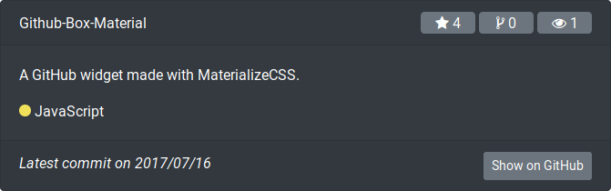
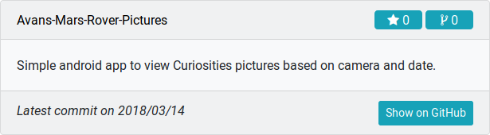

# GitHub-Box-Bootstrap4
A GitHub repository widget built on Bootstrap 4






## Description
GitHub-Box is a small widget that gives you the possibility to show a repository on your webpage or portfolio. It is built on the card layout from Bootstrap 4.

## Dependencies
This widget makes use of Bootstrap 4 and Font Awesome.

## Usage
Include github-repos.js, github-repos.css in any page where you want to display a GitHub-Box.

Display a GitHub-Box:
```html
<a href="//github.com/marc0tjevp/United-GTK">United GTK</a>
```

Create a main object that receives a selector, for which element will be replaced with a GitHub-Box. The link should have this class:
```javascript
GHRepos.create('.gitbox')
```

You can also give it a surrounding to tag. This way all the links in it will become Github-Boxes:
```javascript
GHRepos.create('projects a')
```

You can change the style variables in github-repos.js to use another style. These styles can be found in the [Bootstrap card documentation](https://getbootstrap.com/docs/4.1/components/card/)

## License
This is distributed under the terms of the GNU General Public License, version 2.
