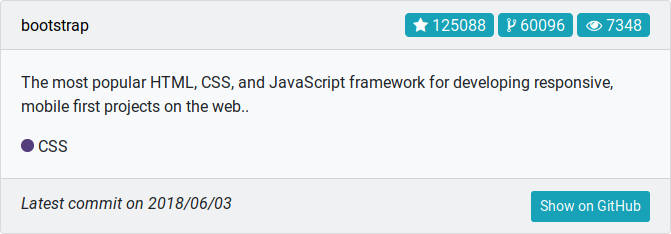
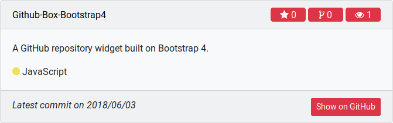
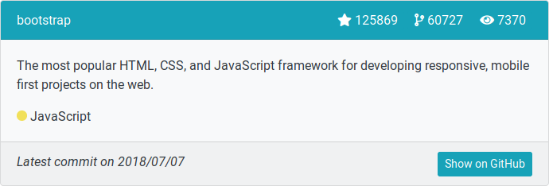
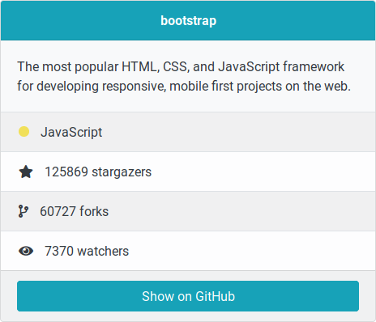

# GitHub-Box-Bootstrap4
A GitHub repository widget built on Bootstrap 4.








## Description
GitHub-Box is a small widget that gives you the possibility to show a repository on your webpage or portfolio. It is built on the card layout from Bootstrap 4.

## Dependencies
This widget makes use of Bootstrap 4 and Font Awesome.

## Usage
Include github-repos.js, github-repos.css in any page where you want to display a GitHub-Box.

Display a GitHub-Box:
```html
<a href="//github.com/marc0tjevp/United-GTK">United GTK</a>
```

You can assign one class to the selector.
```javascript
GHRepos.create('.gitbox')
```

You can also assign a surroundig tag class:
```javascript
GHRepos.create('projects a')
```

## Styling

You can change the style variables in github-repos.js to use another style. These styles can be found in the [Bootstrap card documentation](https://getbootstrap.com/docs/4.1/components/card/)

The language colors can be found in github-repos.css, if your language is not included, you can add a class named *-color, where * is the language displayed in the box.

## License
This is distributed under the terms of the GNU General Public License, version 2.
